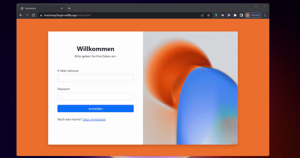

 

  

  <h3 align="center">Responsive Login- und Registrationform</h3>

  

    Erstellt mit Bootstrap5
     
    (nur für Bildungszwecke) 
     
     
    <a href="https://bootstrap5login.netlify.app/">Live Demo</a>
  

# Projekt

  

## Mein Ziel
Mit diesem Projekt wollte ich Bootstrap5 besser verstehen und mein Wissen erweitern, denn wir haben gerade im Informatikunterricht das Modul 152. 
Eigentlich wollte ich noch diese Loginform funktionsfähig machen (mit PHP und MySQL), aber XAMPP wollte auf meinem Laptop nicht laufen, da MySQL immer wieder unexpected abgestürzt ist. Ebenfalls habe ich probiert diesen Fehler zu beheben, indem ich XAMPP ganz gelöscht habe und wieder neu heruntergeladen habe. Danach habe ich noch eine zweite Lösung probiert, und zwar den Ordner "Data" im MySQL Ordner zu duplizieren und dann einen neuen Ordner namens Data zu erstellen. Dies hat ebenfalls nicht funktioniert und somit habe ich mir vorgenommen, in diesem Projekt Bootstrap5 besser zu verstehen. Und durch dieses Projekt konnte ich das "responsive" machen der Webseiten noch besser lernen.

(<a href="#readme-top">back to top</a>)

