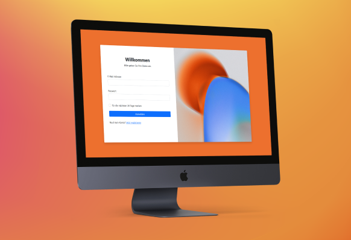

 

  

  <h3 align="center">Responsive Login- und Registrationform</h3>

  

    Erstellt mit Bootstrap5
     
    (nur für Bildungszwecke) 
     
     
    <a href="https://bootstrap5login.netlify.app/">Live Demo</a>
  

# Projekt

